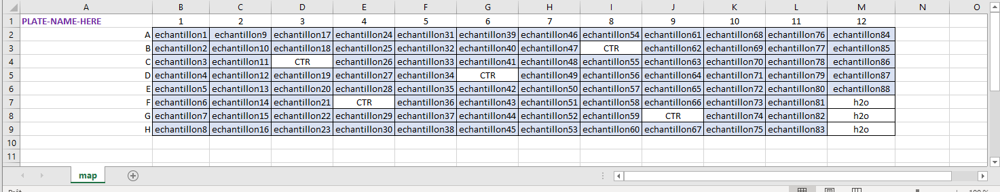
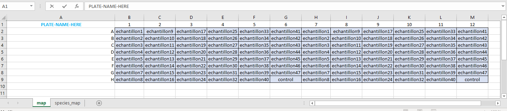
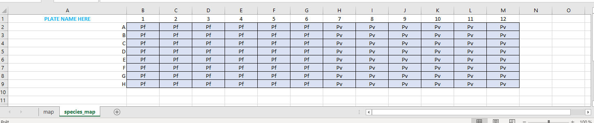

<!-- README.md is generated from README.Rmd. Please edit that file -->

# plasmo.cytB.qPCR

<!-- badges: start -->
<!-- badges: end -->

`plasmo.cytB.qPCR` is a series of functions to easily analyse and QC
real-time qPCR generated following the protocol published by [Canier *et
al.* 2013](https://doi.org/10.1186/1475-2875-12-405), with parameters
and cut-offs optimised for the QuantStudio.

## Installation

You can install the development version of plasmo.cytB.qPCR from
[GitHub](https://github.com/) with:

``` r
devtools::install_github("BourkeCaitlin/plasmo.cytB.qPCR")
```

## Starting a new PCR project

First load the library when using functions from the package.

``` r
library(plasmo.cytB.qPCR)
```

The first function you will likely want to use is `startNewProject()`.
This creates the correct directory structure you will need to work with
the other functions.

**PLEASE ALSO MAKE SURE TO ALWAYS BE WORKING WITHIN AN RProject**.

You can use the same .Rproj for all PCR projects and specify the
different studies with the `project` variable (below), or if you prefer
you can have a different RProject as well for each study - this may vary
depending on overall data setup.

#### Key variables you need to specify:

**`sub_directory`** if you are working within a directory relative to
where your RProject starts, this will be the folder name you specify as
the `sub_directory`.

**`project`** give the project you are working on a name. You will
continue to reference this in all the other commands of this package.

**`species_type`** the laboratory protocol can be adapted to determining
detecting species by either *direct PCR* or with a *nested PCR*. As
these two protocols require slightly different
interpretation/thresholds, you will specify this in your project setup
to create the correct sub-folders for storing data and results. **This
needs to be either “nested_species” or “direct_species”.**

Folders that exist already will not be overwritten.

``` r
startNewProject(sub_directory = "example_subdirectory", 
                project = "project_name", 
                species_type = "nested_species")
```

Your folder structure should look like this:

    #> example_subdirectory
    #> └── project_name
    #>     ├── data
    #>     │   ├── nested_species
    #>     │   ├── rejected_plates
    #>     │   └── screening
    #>     └── results
    #>         ├── nested_species
    #>         │   ├── report
    #>         │   └── spreadsheet
    #>         └── screening
    #>             ├── report
    #>             └── spreadsheet

You will need to store your results (xls/xlsx Quantstudio file) and
plate map (containing the keyword **map** in the filename) **within a
folder** inside the `screening` or `nested_species` directories. This
**folder name will be used** in subsequent functions. Suggestion
something similar to `plate1_initials-date`.

## Create Screening Report

Following a *screening PCR*, to analyse and QC these results, use the
`screeningReport()` function. This will generate within the
`results/screening` directories, a visual report (either html or pdf as
specified in the function) and an xlsx file in the report and
spreadsheet folders, respectively.

#### Key variables you need to specify:

**`sub_directory`** the same as above, if you are working within a
directory relative to where your RProject starts, this will be the
folder name you specify as the `sub_directory`.

**`project`** this is the project name you specified in
`startNewProject()` and is the name of the folder above `results` and
`data`.

**`assay`** this is generating a report for the **screening** assay, so
specify `"screening"`

**`plate_folder`** the name of the folder with the `results/screening`
directory where the platemap (with **map** in the filename) and
Quantstudio file are stored. Suggestion something similar to
`plate1_initials-date`.

**`file_type`** here specify either **“.pdf”** or **“.html”** depending
on whether you want the output report to be in pdf or html format (html
will typically work if pdf throws you errors…)

``` r
screeningReport(sub_directory = "example_subdirectory",
                project = "project_name", 
                assay = "screening", 
                plate_folder = "plate1", 
                file_type = ".pdf")
```

Provided there are no errors, this generates a report that is saved in
`results/screening/report` and an xlsx file in
`results/screening/spreadsheet`

## Interact with screening results while in R

There may be scenarios where you would like to look at the results while
in R and not just obtain the rendered report and spreadsheet.

If so, you can use the function `classifyScreening()`. It uses the exact
same input as above (just without the specification of file_type).

``` r
classifyScreening(sub_directory = "example_subdirectory",
                  project = "project_name", 
                  assay = "screening", 
                  plate_folder = "plate1")
```

This will return a `list` containing

1.  Melt curve plots
2.  Melt curve splits by category
3.  Amplification curves
4.  Colour platelayout
5.  Nested list of raw data
    1.  Consolidated results
    2.  All meltcurve data
    3.  All amplification curve data

## Create Nested Species Report

Just like for a screening PCR, following a nested PCR, generate a QC
summary (report) and spreadsheet using the `nestedSpeciesReport()`
function. Parameters are the same as above with the except specify
**`assay = "nested_species"`**

#### Key variables you need to specify:

**`sub_directory`** the same as above, if you are working within a
directory relative to where your RProject starts, this will be the
folder name you specify as the `sub_directory`.

**`project`** this is the project name you specified in
`startNewProject()` and is the name of the folder above `results` and
`data`.

**`assay`** this is generating a report for the **nested_species**
assay, so specify `"nested_species"`

**`plate_folder`** the name of the folder with the
`results/nested_species` directory where the platemap (with **map** in
the filename) and Quantstudio file are stored. Suggestion something
similar to `plate1_initials-date`.

**`file_type`** here specify either **“.pdf”** or **“.html”** depending
on whether you want the output report to be in pdf or html format (html
will typically work if pdf throws you errors…)

## Interact with nested species results while in R

Like for screening, you can interact with the results while in R and to
do this use the `classifyNestedSpecies()` function with all the same
parameters as `nestedSpeciesReport()` but with no `file_type` specified.

# File specifications

Within every results folder (specified with the `plate_folder` variable
in the above functions) you will need two files. First is the Quanstudio
results file that is exported from the `.eds` output of the machine.
This will have a series of sheets automatically generated including
‘Results’, ‘Melt Curve Raw Data’ and ‘Amplification Data’. You do not
need to modify this file in any way after exporting it from the
QuantStudio software.

Second, you will need to have a platemap file to designate the sample
layout in the 96 well plate format. This requires the sheet of the
platemap to be called `map` and if it is a species-specific PCR (nested
or direct) you will also need a second sheet named `species_map`
specifying which primers are in which wells (use Pf, Pv, Pm or Po).

**A screening platemap will look approximately like:**



**A species platemap will look approximately like:**





**FILE NAMING**

Only the platemap file MUST have the word ‘map’ in the filename. The
Quanstudio export does not have any naming requirements except to be the
only other xls or xlsx file accompanying the map-named file in the
folder. It is fine to store the original QuantStudio raw data (.eds)
file in this same folder.

## Merge all results into one database

The `createPCRdatabase()` function is to be used when wanting to merge
results from one project into one project. This function has several
assumptions…

1.  If you have repeated a plate for QC purposes, you have stored the
    ‘rejected’ results somewhere else - **importantly, they are not
    stored in the results folder for screening or
    nested_species/direct_species**
2.  If for example you have one sample on plate that you had had to
    repeat, you modify the sampleID to flag this as a rejected sample
    with ‘-REJ’ for example. This prevents merging issues

### Usage

``` r
createPCRdatabase(sub_directory = "sub_directory",
                  project = "project_name",
                  species_type = "nested_species")
```

## Follow along with an example:

Within the ‘data’ folder there are example raw data and example QC
reports too, stored in their respective folders. You can test the above
functions with the above data downloading the ‘data’ folder.

1.  startNewProject(), using ‘data’ as the sub_directory

``` r
startNewProject(sub_directory = "data", project = "example", species_type = "nested_species")
```

2.  Generate screeningReport()

-   to generate pdf report

``` r
screeningReport(sub_directory = "data", 
                project = "example", 
                assay = "screening",
                plate_folder = "example-screening-plate1",
                file_type = ".pdf")
```

-   to generate html report (sometimes pdf will bug depending on
    computer, and html will usually work)

``` r
screeningReport(sub_directory = "data", 
                project = "example", 
                assay = "screening",
                plate_folder = "example-screening-plate1",
                file_type = ".html")
```

By default `assay = "screening"` and does not need to be explicitly
specified when calling screeningReport.

3.  Generate nestedSpeciesReport()

-   to generate pdf output

``` r
nestedSpeciesReport(sub_directory = "data", 
                project = "example", 
                assay = "nested_species",
                plate_folder = "example-nestedspecies-plate1",
                file_type = ".pdf")
```

-   to generate html output

``` r
nestedSpeciesReport(sub_directory = "data", 
                project = "example", 
                assay = "nested_species",
                plate_folder = "example-nestedspecies-plate1",
                file_type = ".html")
```

4.  Summarise all results from project in validated plates

``` r
createPCRdatabase(sub_directory = "data",
                  project = "example",
                  species_type = "nested_species")
```
